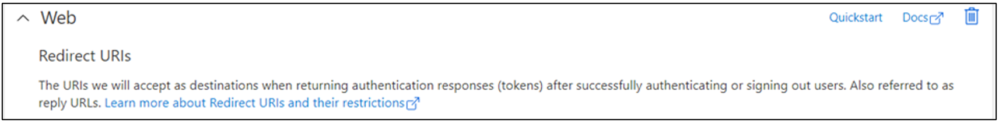
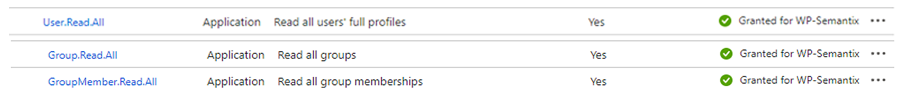
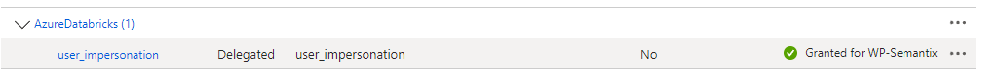
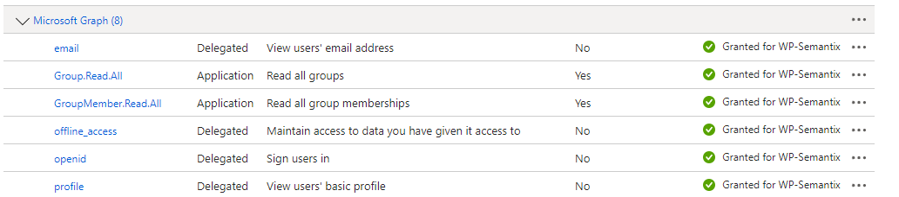
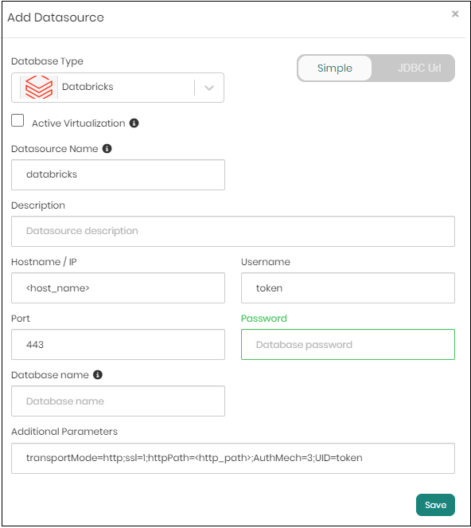

# Optional Services Configurations for Deployment with Timbr

## Timbr Virtualization Service

In the web platform of timbr, add a new datasource with this specifications:

1. Datasource Type: `Apache Spark`
   - Click on the `Active Virtualization` check-box
2. Datasource Name: `timbr_virtualization`
3. Hostname/IP: `<virtualization hostname if applicable>` (or use default: `timbr-virtualization`)
4. Port: `<virtualization port if applicable>` (or use default: `10000`)
5. User: `timbr`
6. Password: `<timbr-db-password>`


### Important
> **Hostname/IP** value is the hostname in docker/Kubernetes for Timbr virtualization service.
> **Port** value is the port in docker/Kubernetes for Timbr virtualization service.
> **Password** value is the timbr-db password.

---

## Timbr Cache Service

In the web platform of Timbr, add a new datasource with this specifications:


1. Datasource Type: `Clickhouse`
2. Datasource Name: `timbr_cache`
3. Hostname/IP: `<timbr-cache hostname>` (or use default: `timbr-cache`)
4. port: `<timbr-cache port>` (or use default: `8123`)
5. User: `timbr`
6. Password: `<timbr-db-password>`
7. Additional parameters: `socket_timeout=21600000&custom_http_params=connect_timeout%3D3600%2Chttp_send_timeout%3D3600%2Chttp_receive_timeout%3D3600%2Chttp_max_tries%3D1%2Cjoin_algorithm%3Dpartial_merge%2Cmax_query_size%3D5000000%2Cmax_rows_in_set_to_optimize_join%3D200000%2Cmax_threads%3D10%2Cmax_final_threads%3D8`


### Important
> **Hostname/IP** value is the hostname in docker/Kubernetes for Timbr cache service.
> **Port** value is the port in docker/Kubernetes for Timbr cache service.
> **Password** value is the timbr-db password.

---

## Timbr GA (Timbr Graph Algorithms) Service

Timbr graph algorithms can be configure in two ways:

1. Enable graph algorithms to all of the ontologies in Timbr
or
2. Enable graph algorithms to a specific ontology in Timbr

-  In order to **enable graph algorithms to all of the ontologies in Timbr** you have to add a new environment variable to the `timbr-server` service:

   - For **Docker Compose Deployment**:

      In your `docker-compose.yaml` add those changes to the **timbr-server** service:

      ``` yaml
      services:
        timbr-server:
          # ...
          environment:
            - graph_algorithm_manager_url=http://timbr-ga:12000/execute_algorithm
      ```

   - For **K8S Deployment**:

      In your **Timbr server** deployment YAML file, configure the following environment variable:

      ```yaml
      spec:
        # ...
        template:
          # ...
          spec:
            # ...
            containers:
              - name: timbr-server
                # ...
                env:
                  # ...
                  - name: graph_algorithm_manager_url
                    value: http://timbr-ga:12000/execute_algorithm
      ```

 - To **enable graph algorithms to a specific ontology in timbr**, In the web platform of timbr, open the `sqllab` tab and run this query:

      ``` yaml
      alter ontology <ontology_name> set graph_algorithm_manager_url = 'http://timbr-ga:12000/execute_algorithm'
      ```

---

## Connect Timbr Platform to Google Analytics

In order to connect the **Timbr Platform** to **Google Analytics** you should add a new environment variable to the `timbr platform` service 

### Deployment options
1. **Docker Compose**

    In your `docker-compose.yaml` add those changes to the **timbr-platform** service:

    ``` yaml
    services:
      timbr-platform:
        # ...
        environment:
          - GOOGLE_ANALYTICS_TAG=<GOOGLE_ANALYTICS_TAG>
    ```

2. **K8S**

    In your **Timbr Platform** deployment YAML file, configure the following environment variable:

    ```yaml
    spec:
      # ...
      template:
        # ...
        spec:
          # ...
          containers:
            - name: timbr-platform
              # ...
              env:
                # ...
                - name: GOOGLE_ANALYTICS_TAG
                  value: <GOOGLE_ANALYTICS_TAG>
    ```

---

## Configure SSO Google cloud in Timbr

Please make sure you have an **HTTPS** endpoint (Google Cloud SSO doesn't allow configuring HTTP servers). 
The **Timbr Platform** service should have an existing SSL certificate. 

Once the SSL is configured, you can create the App Registration in Google Cloud to enable the SSO authentication.

In order to configure the SSO with Google Cloud in Timbr, you will need the following App Registration details: 

- **CLIENT_ID**

- **CLIENT_SECRET**

### Deployment options
1. **Docker Compose**

    In your `docker-compose.yaml` add those changes to the **timbr-platform** service:

    ``` yaml
    services:
      timbr-platform:
        # ...
        environment:
          - OAUTH_PROVIDER=google
          - OAUTH_CLIENT_ID=<GOOGLE_CLOUD_CLIENT_ID>
          - OAUTH_SECRET=<GOOGLE_CLOUD_CLIENT_SECRET>
          - USE_BIGQUERY_TOKEN=false
    ```

    > **NOTICE:**
    > In case of using Big Query database and you want to authenticate per user to query Big Query replace the value of `USE_BIGQUERY_TOKEN` environment variable to `true`.
    > Should look like this: `- USE_BIGQUERY_TOKEN=true`

2. **K8S**

    In your **Timbr Platform** deployment YAML file, configure the following environment variables:

    ```yaml
    spec:
      # ...
      template:
        # ...
        spec:
          # ...
          containers:
            - name: timbr-platform
              # ...
              env:
                # ...
                - name: OAUTH_PROVIDER
                  value: google
                - name: OAUTH_CLIENT_ID
                  value: <GOOGLE_CLOUD_CLIENT_ID>
                - name: OAUTH_SECRET
                  value: <GOOGLE_CLOUD_CLIENT_SECRET>
                - name: USE_BIGQUERY_TOKEN
                  value: false
    ```

    > **NOTICE:**
    > In case of using Big Query database and you want to authenticate per user to query Big Query replace the value of `USE_BIGQUERY_TOKEN` environment variable to `true`.
    > Should look like this:
    >
    > `- name: USE_BIGQUERY_TOKEN`
    >
    > `   value: true`

---

## Configure Azure AD SSO in Timbr

Please make sure you have an **HTTPS** endpoint (Azure AD doesn't allow configuring HTTP servers). 
The `timbr platform` should have an existing SSL certificate. 

Once the SSL is configured, you can create the App Registration in Azure to enable the SSO authentication.

In order to configure the SSO with Azure AD in Timbr, you will need the following App Registration details: 

- **AZURE_APPLICATION_ID**

- **AZURE_TENANT_ID**

- **AZURE_SECRET**

Moreover, you need to know how does your Azure AD users would accesss to the Timbr environment and it could be one of those 2 options:
1. Using `Azure UserPrincipalName`
2. Using `Email Address`

The App Registration needs the following permissions:

| Microsoft Graph (4) | Scope | Delegation | Description |
|-------|-----------|--------|-------|
|  | **email** | Delegated | View users' email address |
|  | **openid** | Delegated | Sign users in |
|  | **profile** | Delegated | View users' basic profile |
|  | **User.Read** | Delegated | Sign in and read user profile |


In the authentication tab of App Registration, add the redirect URL (Under web) with your Timbr public URL 

                        https://<timbr-public-url>/oauth-authorized/azure

Once you have set the App Registration, you can configure the YAML file of **timbr-platform** together with the environment variable to enable the SSO authentication.



### Deployment options
1. **Docker Compose**

    In your `docker-compose.yaml` add those changes to the **timbr-platform** service:

    ``` yaml
    services:
      timbr-platform:
        # ...
        environment:
          - OAUTH_PROVIDER=azure
          - OAUTH_CLIENT_ID=<AZURE_APPLICATION_ID>
          - OAUTH_SECRET=<AZURE_SECRET>
          - OAUTH_BASE_URL=https://login.microsoftonline.com/<AZURE_TENANT_ID>/oauth2
          - OAUTH_AZURE_WITH_UPN_FIRST=False
    ```

    > **NOTICE:**
    > In case of using `Azure UserPrincipalName` replace the value of `OAUTH_AZURE_WITH_UPN_FIRST` environment variable to `True`.
    > Should look like this: `- OAUTH_AZURE_WITH_UPN_FIRST=True`

2. **K8S**

    In your **Timbr Platform** deployment YAML file, configure the following environment variables:

    ```yaml
    spec:
      # ...
      template:
        # ...
        spec:
          # ...
          containers:
            - name: timbr-platform
              # ...
              env:
                # ...
                - name: OAUTH_PROVIDER
                  value: azure
                - name: OAUTH_CLIENT_ID
                  value: <AZURE_APPLICATION_ID>
                - name: OAUTH_SECRET
                  value: <AZURE_SECRET>
                - name: OAUTH_BASE_URL
                  value: https://login.microsoftonline.com/<AZURE_TENANT_ID>/oauth2
                - name: OAUTH_AZURE_WITH_UPN_FIRST
                  value: False
    ```

    > **NOTICE:**
    > In case of using `Azure UserPrincipalName` replace the value of `OAUTH_AZURE_WITH_UPN_FIRST` environment variable to `True`.
    > Should look like this:
    >
    > `- name: OAUTH_AZURE_WITH_UPN_FIRST`
    >
    > `   value: True`

---

## Sync Azure AD Groups with Timbr Roles

The first step to sync the Azure AD Groups with Timbr roles, is to configure additional permissions in the App Registration where the Timbr Platform SSO is defined. 

Add the following permissions:

- **User.Read.All**

- **Group.Read.All**

- **GroupMember.Read.All**



After that you need to set the App Registration `client_id`, `tenant_id`, and `secret`, in the **timbr server** section of the deployment:

1. **Docker Compose**

    In your `docker-compose.yaml` add those changes to the **timbr-server** service:

    ``` yaml
    services:
      timbr-server:
        # ...
        environment:
          - AZURE_CLIENT_ID=<AZURE_CLIENT_ID>
          - AZURE_TENANT_ID=<AZURE_TENANT_ID>
          - AZURE_CLIENT_SECRET=<AZURE_CLIENT_SECRET>
          - SYNC_GROUPS_INTERVAL=86400
          - SYNC_GROUPS_AUTO_CREATE=false
    ```

2. **K8S**

    In your **Timbr Server** deployment YAML file, configure the following environment variables:

    ```yaml
    spec:
      # ...
      template:
        # ...
        spec:
          # ...
          containers:
            - name: timbr-server
              # ...
              env:
                # ...
                - name: AZURE_CLIENT_ID
                  value: <AZURE_CLIENT_ID>
                - name: AZURE_TENANT_ID
                  value: <AZURE_TENANT_ID>
                - name: AZURE_CLIENT_SECRET
                  value: <AZURE_CLIENT_SECRET>
                - name: SYNC_GROUPS_INTERVAL
                  value: 86400
                - name: SYNC_GROUPS_AUTO_CREATE
                  value: false
    ```

3. **Choose Timbr roles to sync from AD Groups:**

    Once we've set up the environment variables in **timbr-server**, you can set **any role** to sync from Azure AD Group. 

    To configure which group to sync, you can use the **Group Name** or **Group ID** or **Group Email**, and run the following SQL statements in the **SQL Lab** page of the **Timbr Platform**:
    ```sql
    ALTER ROLE `role_name` SYNC name = 'group_name'
    ```

    **or**
    ```sql
    ALTER ROLE `role_name` SYNC id = 'group_id'
    ```

    **or**
    ```sql
    ALTER ROLE `role_name` SYNC email = 'group_email'
    ```

    Once a role is synced, it has a default update interval of 24 hours. The sync interval is configurable and can be customized by adding the variable **SYNC_GROUPS_INTERVAL=time_in_seconds** to the docker compose file under **timbr server**. In case you need to manually sync the role, run the following SQL statement:

    ```sql
    SYNC ROLE `role_name`;
    ```

    To automatically create users according to new users added to AD Groups, you can add the variable **SYNC_GROUPS_AUTO_CREATE_USER=TRUE** to the docker compose file under **timbr server**.


---


## SSO for Databricks Datasources (passthrought) in Azure

First, make sure you have an **HTTPS** endpoint (Google Cloud SSO doesn't allow configuring HTTP servers) so that the **Timbr Platform** should have an existing SSL certificate. 

Once the SSL is configured, you can create the App Registration in Azure Databricks to enable the SSO authentication.

Second, in order to configure the SSO with Azure Databricks in Timbr, you will need the following App Registration details:

- **Delegated `user_impersonation` for AzureDatabricks**


<!--  -->

- **`offline_access` in Microsoft Graph**


<!--  -->

### Deployment options
1. **Docker Compose**

In your `docker-compose.yaml` add those changes to the **timbr-platform** and **timbr-server** services:

``` yaml
services:
  timbr-platform:
    # ...
    environment:
      - OAUTH_OFFLINE_ACCESS_SCOPE='true'
      - OAUTH_SCOPES=2ff814a6-3304-4ab8-85cb-cd0e6f879c1d/user_impersonation
  # ...
  timbr-server:
    # ...
    environment:
      - OAUTH_OFFLINE_ACCESS_SCOPE=true
      - OAUTH_REFRESH_TOKEN_EXPIRATION=10
      - OAUTH_REFRESH_TOKEN_VALIDATION=1
```

2. **K8S**

In your **Timbr Platform** deployment YAML file, configure the following environment variable:

```yaml
spec:
  # ...
  template:
    # ...
    spec:
      # ...
      containers:
        - name: timbr-platform
          # ...
          env:
            # ...
            - name: OAUTH_OFFLINE_ACCESS_SCOPE
              value: 'true'
            - name: OAUTH_SCOPES
              value: 2ff814a6-3304-4ab8-85cb-cd0e6f879c1d/user_impersonation
```

In your **Timbr Server** deployment YAML file, configure the following environment variable:

```yaml
spec:
  # ...
  template:
    # ...
    spec:
      # ...
      containers:
        - name: timbr-server
          # ...
          env:
            # ...
            - name: OAUTH_OFFLINE_ACCESS_SCOPE
              value: true
            - name: OAUTH_REFRESH_TOKEN_EXPIRATION
              value: 10
            - name: OAUTH_REFRESH_TOKEN_VALIDATION
              value: 1
```

In the web platform of timbr, add a new datasource with this specifications:

1. Datasource Type: `Databricks`
3. Datasource Name: `databricks`
4. Hostname/IP: `<datasource hostname>`
5. Port: `443`
6. User: `token`
7. Password: `<sso token value>`

In the `Additional Parameters` change the `AuthMech` to 11 and the `Auth_Flow`to 0. It should look like this:

```
... AuthMech=11;Auth_Flow=0 ...
```



---

## How to setup KeyVault (Azure/AWS) for datasources credentials

Refrences:

[Azure KV](https://azure.microsoft.com/en-us/products/key-vault)

[AWS KMS](https://docs.aws.amazon.com/kms/latest/developerguide/overview.html)

By default Timbr encrypt and stores all the of yours Datasource credentials in timbr's Database.
You can change it and configure Timbr to encrypt and store your Datasource credentials yours KeyVault (Azure KV/AWS KMS).

**Important**
If you choose to use the KeyVault option it means that all Datasource passwords will be stored in KV instead of timbr's db.

1. **AWS deployment**
  
1. **Docker Compose Deployment**
  In your `docker-compose.yaml` add those changes to the **timbr-server** service:

  ``` yaml
  services:
    # ...
    timbr-server:
      # ...
      environment:
        - KV_VAULT_TYPE="aws"
        - KV_VAULT_AUTH_TYPE="password"
        - KV_VAULT=<KMS_NAME>
        - KV_VAULT_REGION="<KMS_REGION>"
        - AWS_CLIENT_ID="<AWS_CLIENT_ID>"
        - AWS_CLIENT_SECRET="<AWS_CLIENT_SECRET>"
  ```
  2. **K8S Deployment**

  In your **Timbr Server** deployment YAML file, configure the following environment variables:

  ```yaml
  spec:
    # ...
    template:
      # ...
      spec:
        # ...
        containers:
          - name: timbr-server
            # ...
            env:
              # ...
              - name: KV_VAULT_TYPE
                value: "aws"
              - name: KV_VAULT_AUTH_TYPE
                value: "password"
              - name: KV_VAULT
                value: "<KV_URL>"
              - name: KV_VAULT_REGION
                value: "<KMS_REGION>"
              - name: AWS_CLIENT_ID
                value: "<AWS_CLIENT_ID>"
              - name: AWS_CLIENT_SECRET
                value: "<AWS_CLIENT_SECRET>"
  ```


2. **Azure deployment**

1. **Docker Compose Deployment**
  
    In your `docker-compose.yaml` add those changes to the **timbr-server** service:

    ``` yaml
    services:
      # ...
      timbr-server:
        # ...
        environment:
          - KV_VAULT_TYPE="azure"
          - KV_VAULT_AUTH_TYPE="password"
          - KV_VAULT=<KV_URL>
          - AZURE_CLIENT_ID="<AZURE_CLIENT_ID>"
          - AZURE_TENANT_ID="<AZURE_TENANT_ID>"
          - AZURE_CLIENT_SECRET="<AZURE_CLIENT_SECRET>"
    ```

2. **K8S Deployment**

    In your **Timbr Server** deployment YAML file, configure the following environment variables:

    ```yaml
    spec:
      # ...
      template:
        # ...
        spec:
          # ...
          containers:
            - name: timbr-server
              # ...
              env:
                # ...
                - name: KV_VAULT_TYPE
                  value: "azure"
                - name: KV_VAULT_AUTH_TYPE
                  value: "password"
                - name: KV_VAULT
                  value: "<KMS_NAME>"
                - name: AZURE_CLIENT_ID
                  value: "<AZURE_CLIENT_ID>"
                - name: AZURE_TENANT_ID
                  value: "<AZURE_TENANT_ID>"
                - name: AZURE_CLIENT_SECRET
                  value: "<AZURE_CLIENT_SECRET>"
    ```

  ---

## How to setup JWT Token (Azure or Keycloack) for timbr-api

The Timbr REST API Service supports offline authentication using JWT tokens (Open ID).
This authentication method allows Azure AD, Microsoft Identity Platform and OAuth 2.0 Open ID Connect (OIDC) to verify user identities using JWT tokens, even in multi-tenant environments. 

### Azure JWT

- **Docker Compose Deployment**

    In your `docker-compose.yaml` add those changes to the **timbr-api** service:

    ``` yaml
    services:
      timbr-api:
        # ...
        environment:
          - ENABLE_TOKEN=true
          - JWT_TYPE=azure
    ```

- **K8S Deployment**

    In your **timbr-api** deployment YAML file, configure the following environment variable:

    ```yaml
    spec:
      # ...
      template:
        # ...
        spec:
          # ...
          containers:
            - name: timbr-api
              # ...
              env:
                # ...
                - name: ENABLE_TOKEN
                  value: true
                - name: JWT_TYPE
                  value: azure
    ```

#### Azure JWT Environment Variables

Please note the following requirements for environment variables:

- All JWT environment variables **must be in uppercase**.

The following environment variables can be set and serve as default values for the Timbr API Service:

| Environment Variable | Required | Default Value | Possible Values | Description |
|----------------------|----------|---------------|-----------------|-------------|
| `ENABLE_TOKEN` | ✔️ | `false` | `false` or `true` | This value **must be set to `true`** to enable JWT authentication in Timbr. |
| `JWT_TYPE` | ✔️ | `custom` | `custom` or `azure` | This value **must be set to `azure`** in order to enable JWT authentication with Azure in Timbr. |
| `JWT_DEFAULT_ALGORITHM` | ✖️ | `RS246` | `HS256`, `RSA-OAEP`, `RS256`, `AES` | `RS246` or `RSA-OAEP` should be used with a **Public Key**, while `HS256` (hmac) or `AES` should be used with a **Secret Password**. You can specify multiple algorithms by separating them with commas, for example, `RS246,RSA-OAEP`, to use both algorithms in the decryption process. |
| `JWT_DEFAULT_AUDIENCE` | ✖️ | _None_ | string | The audience is commonly the *Client ID*. If this value is not set, the JWT will be decrypted without audience validation. This can also be set through using the `x-jwt-client-id` header in the request |
| `JWT_USE_EMAIL_OR_USER` | ✖️ | `upn` | string | The key storing the value in the JWT token with information about the username or email to be authernticated in Timbr. |
| `JWT_ISSUER` | ✖️ | _None_ | string | The default value for the issuer of the JWT token, can also be passed as a request header for multi-tenant environments. The issuer value is a case sensitive URL using the https scheme that contains scheme, host, and optionally, port number and path components and no query or fragment components.|

#### Azure JWT Request Headers

Please note the following requirements for request headers:

- All headers **must be in lowercase**.

| Header Key | Required | Header Value | Description |
|----------------------|----------|---------------|-----------------|
| `x-jwt-token` | ✔️ | string | The access token of the JWT. |
| `x-jwt-tenant-id` | ✖️ | string | The tenant ID value used by the `JWT_<TENANT_ID>...` environment variables. |
| `x-jwt-issuer` | ✖️ | string | Issuer identifier for the Issuer of the token. The issuer value is a case sensitive URL using the https scheme that contains scheme, host, and optionally, port number and path components and no query or fragment components. |
| `x-jwt-client-id` | ✖️ | string | The audience for the JWT. Audience(s) that this ID Token is intended for. It MUST contain the OAuth 2.0 client_id of the Relying Party as an audience value. It MAY also contain identifiers for other audiences. In the general case, the aud value is an array of case sensitive strings. In the common special case when there is one audience, the aud value MAY be a single case sensitive string. |
| `x-jwt-nonce` | ✖️ | string | If present in the JWT, Clients MUST verify that the nonce Claim Value is equal to the value of the nonce parameter sent in the Authentication request. The nonce value is a case sensitive string. |

#### Using Azure JWT in Multi-tenant Environments

In a multi-tenant environment, you can set specific credentials for different realms by defining environment variables specific to each tenant. Replace `<TENANT_ID>` with an alphanumeric tenant identifier. These settings take precedence over the `JWT_DEFAULT...` values when decrypting the JWT access token.

| Environment Variable | Required | Default Value | Possible Values | Description |
|----------------------|----------|---------------|-----------------|-------------|
| `JWT_<TENANT_ID>_ALGORITHM` | ✖️ | `RS246` | `HS256`, `RSA-OAEP`, `RS256`, `AES` | `RS246` or `RSA-OAEP` should be used with a **Public Key**, while `HS256` (hmac) or `AES` should be used with a **Secret Password**. You can specify multiple algorithms by separating them with commas, for example, `RS246,RSA-OAEP`, to use both algorithms in the decryption process. |
| `JWT_<TENANT_ID>_AUDIENCE` | ✖️ | _None_ | string | The audience is commonly the *Client ID*. If this value is not set, the JWT will be decrypted without audience validation. This can also be set through using the `x-jwt-client-id` header in the request |
| `JWT_USE_TENANT_USER` | ✖️ | `False` | `False` or `True` | When set to `True`, the **username** or **email** will have a prefix of the **tenant id** (as specified by the `x-jwt-tenant-id` header in the request) and will be authenticated as `<tenant id>/<username or email>` according to the value specified in the environment variable `JWT_USE_EMAIL_OR_USER`. |

Using `JWT_USE_TENANT_USER` Environment Variable Example:

>   - An incoming request with a **x-jwt-tenant-id** header containing the value `tenant-5`.
>   - A **JWT token** of the username `bob`.
> 
>   In this scenario, when the following environment variables are set:
> 
>   - **JWT_USE_EMAIL_OR_USER** environment variable set to `username`.
>   - **JWT_USE_TENANT_USER** environment variable set to `True`.
> 
>   (Assuming the other required environment variables are also set)
> 
>   Timbr will authenticate the user with the username `tenant-5/bob`


### Keycloack JWT

- **Docker Compose Deployment**

    In your `docker-compose.yaml` add those changes to the **timbr-api** service:

    ``` yaml
    services:
      timbr-api:
        # ...
        environment:
          - ENABLE_TOKEN=true
          - JWT_DEFAULT_KEY=<PUBLIC_KEY>
    ```

- **K8S**

    In your **timbr-api** deployment YAML file, configure the following environment variable:

    ```yaml
    spec:
      # ...
      template:
        # ...
        spec:
          # ...
          containers:
            - name: timbr-api
              # ...
              env:
                # ...
                - name: ENABLE_TOKEN
                  value: true
                - name: JWT_DEFAULT_KEY
                  value: <PUBLIC_KEY>
    ```

#### Keycloack JWT Environment Variables

Please note the following requirements for environment variables:

- All environment variables **must be in uppercase**.

The following environment variables can be set and serve as default values for the Timbr API Service:

| Environment Variable | Required | Default Value | Possible Values | Description |
|----------------------|----------|---------------|-----------------|-------------|
| `ENABLE_TOKEN` | ✔️ | `false` | `false` or `true` | This value **must be set to `true`** to enable JWT authentication in Timbr. |
| `JWT_DEFAULT_KEY` | ✔️ | _None_ | **Public Key** or **Secret Password**  | A string representing the **Public Key** or **Secret Password** used for decryption with `JWT_DEFAULT_ALGORITHM`. In the case of a **Public Key** (e.g., for Keycloak), the public key should include the placeholders before (`\n-----BEGIN PUBLIC KEY-----\n`) and after (`\n-----END PUBLIC KEY-----\n`) the key itself. |
| `JWT_DEFAULT_ALGORITHM` | ✖️ | `RS246` | `HS256`, `RSA-OAEP`, `RS256`, `AES` | `RS246` or `RSA-OAEP` should be used with a **Public Key**, while `HS256` (hmac) or `AES` should be used with a **Secret Password**. You can specify multiple algorithms by separating them with commas, for example, `RS246,RSA-OAEP`, to use both algorithms in the decryption process. |
| `JWT_DEFAULT_AUDIENCE` | ✖️ | _None_ | string | For Keycloak, the audience is commonly the *Client ID* in a Keycloak realm. If this value is not set, the JWT will be decrypted without audience validation. |
| `JWT_USE_EMAIL_OR_USER` | ✖️ | `email` | `email` or `username` | Whether or not Timbr should use the `email` or the `username` value from the token to internally authenticate with Timbr. |
| `JWT_TYPE` | ✖️ | `custom` | `custom` or `azure` | Specify the type of JWT token to be used to with authenticating to Timbr. By default the value is `custom` so no change needed for this type of authentication. |

#### Keycloack JWT Request Headers

Please note the following requirements for request headers:

- All headers **must be in lowercase**.

| Header Key | Required | Header Value | Description |
|----------------------|----------|---------------|-----------------|
| `x-jwt-token` | ✔️ | string | The access token of the JWT. |
| `x-jwt-tenant-id` | ✖️ | string | The tenant ID value used by the `JWT_<TENANT_ID>...` environment variables. |

#### Using Keycloack JWT in Multi-tenant Environments

In a multi-tenant environment, you can set specific credentials for different realms by defining environment variables specific to each tenant. Replace `<TENANT_ID>` with an alphanumeric tenant identifier. These settings take precedence over the `JWT_DEFAULT...` values when decrypting the JWT access token.

| Environment Variable | Required | Default Value | Possible Values | Description |
|----------------------|----------|---------------|-----------------|-------------|
| `JWT_<TENANT_ID>_KEY` | ✖️ | _None_ | **Public Key** or **Secret Password**  | A string representing the **Public Key** or **Secret Password** used for decryption with `JWT_<TENANT_ID>_ALGORITHM`. In the case of a **Public Key** (e.g., for Keycloak), the public key should include the placeholders before (`\n-----BEGIN PUBLIC KEY-----\n`) and after (`\n-----END PUBLIC KEY-----\n`) the key itself. |
| `JWT_<TENANT_ID>_ALGORITHM` | ✖️ | `RS246` | `HS256`, `RSA-OAEP`, `RS256`, `AES` | `RS246` or `RSA-OAEP` should be used with a **Public Key**, while `HS256` (hmac) or `AES` should be used with a **Secret Password**. You can specify multiple algorithms by separating them with commas, for example, `RS246,RSA-OAEP`, to use both algorithms in the decryption process. |
| `JWT_<TENANT_ID>_AUDIENCE` | ✖️ | _None_ | string | For Keycloak, the audience is commonly the *Client ID* in a Keycloak realm. If this value is not set, the JWT will be decrypted without audience validation. |
| `JWT_USE_TENANT_USER` | ✖️ | `False` | `False` or `True` | When set to `True`, the **username** or **email** will have a prefix of the **tenant id** (as specified by the `x-jwt-tenant-id` header in the request) and will be authenticated as `<tenant id>/<username or email>` according to the value specified in the environment variable `JWT_USE_EMAIL_OR_USER`. |

Using `JWT_USE_TENANT_USER` Environment Variable Example

> - An incoming request with a **x-jwt-tenant-id** header containing the value `tenant-5`.
> - A **JWT token** of the username `bob`.
> 
> In this scenario, when the following environment variables are set:
> 
> - **JWT_USE_EMAIL_OR_USER** environment variable set to `username`.
> - **JWT_USE_TENANT_USER** environment variable set to `True`.
> 
> (Assuming the other required environment variables are also set)
> 
> Timbr will authenticate the user with the username `tenant-5/bob`

## How to setup the Timbr Chat Bot for Microsoft Teams and Slack

The Timbr Chat Bot lets users ask questions about an ontology in natural language directly from Microsoft Teams or Slack. It runs inside the **timbr-api** service - there is no extra container to deploy.

Teams and Slack share the same master switch (`ENABLE_CHAT_BOT`) and the same default ontology or agent. You can enable either platform on its own, or both at once.

### Prerequisites

- **An LLM must be configured on timbr-api.** `TIMBR_LLM_TYPE`, `TIMBR_LLM_MODEL` and `TIMBR_LLM_APIKEY` must all be set on the **timbr-api** service.
- **A publicly reachable HTTPS endpoint.** Webhooks are delivered by the Azure Bot Service (Teams) and by Slack, so your Timbr API host must be reachable from the internet with a valid certificate. Self-signed certificates will not work.
- **An ontology or an agent** that the bot answers from.

### Microsoft Teams

#### Step 1: Register an Azure Bot

In the Azure Portal, create an **Azure Bot** resource:

1. Choose a unique bot handle.
2. Select **Single tenant** as the type (recommended for internal use).
3. Select **Create new Microsoft App ID**.

#### Step 2: Configure the messaging endpoint

In the bot's **Configuration** blade, set the **Messaging endpoint** to:

```
https://<your-timbr-api-host>/timbr/api/chatbot/teams/api/messages
```

Then:

1. Copy the **Microsoft App ID** - this becomes `CHAT_BOT_TEAMS_APP_ID`.
2. Go to **Configuration → Manage Password** and generate a client secret. Copy the secret **value** (not the secret ID) - this becomes `CHAT_BOT_TEAMS_APP_PASSWORD`.
3. Copy the **Directory (tenant) ID** - this becomes `CHAT_BOT_TEAMS_TENANT_ID`.

#### Step 3: Enable the Microsoft Teams channel

In the bot's **Channels** blade, add the **Microsoft Teams** channel.

#### Step 4: Chat Bot Environment Variables

All of these are set on the **timbr-api** service.

| Environment Variable | Required | Default Value | Description |
|----------------------|----------|---------------|-------------|
| `ENABLE_CHAT_BOT` | ✔️ | `false` | Master switch. Must be set to `true` to enable the chat bot. |
| `CHAT_BOT_DEFAULT_ONTOLOGY` | ✔️* | _None_ | The ontology the bot queries by default. Set **exactly one** of this or `CHAT_BOT_DEFAULT_AGENT`. |
| `CHAT_BOT_DEFAULT_AGENT` | ✔️* | _None_ | The agent the bot uses instead of an ontology. Set **exactly one** of this or `CHAT_BOT_DEFAULT_ONTOLOGY`. |
| `CHAT_BOT_TEAMS_APP_ID` | ✔️ | _None_ | The Microsoft App ID from the Azure Bot registration. |
| `CHAT_BOT_TEAMS_APP_PASSWORD` | ✔️ | _None_ | The client secret **value** generated for the Azure Bot. |
| `CHAT_BOT_TEAMS_TENANT_ID` | ✔️ | _None_ | The Directory (tenant) ID. Required for single-tenant bots; leave empty for multi-tenant. |
| `CHAT_BOT_DEFAULT_PARAMS` | ✖️ | _None_ | Optional JSON overrides passed in the `/answer` header. |
| `CHAT_BOT_MAX_PREVIEW_ROWS` | ✖️ | `50` | Maximum rows shown inline in a chat reply. |
| `CHAT_BOT_MAX_EXPORT_ROWS` | ✖️ | `10000` | Maximum rows included in a CSV export. |
| `CHAT_BOT_RESULT_STATE_TTL_SECONDS` | ✖️ | `86400` | How long a query result stays available for download (24 hours). |
| `CHAT_BOT_IDENTITY_CACHE_TTL_SECONDS` | ✖️ | `3600` | How long a resolved chat identity is cached. |
| `CHAT_BOT_DEDUP_TTL_SECONDS` | ✖️ | `300` | Window used to discard duplicate webhook deliveries. |
| `CHAT_BOT_INFLIGHT_TTL_SECONDS` | ✖️ | `120` | How long an in-flight request is tracked before being considered abandoned. |

\* Exactly one of `CHAT_BOT_DEFAULT_ONTOLOGY` or `CHAT_BOT_DEFAULT_AGENT` is required.

#### Step 5: Build and sideload the Teams app package

Create a ZIP archive containing exactly these three files **at the root** of the archive (not inside a folder):

| File | Requirement |
|------|-------------|
| `manifest.json` | `id` and `botId` both set to the Microsoft App ID; `validDomains` must include your Timbr API host |
| `color.png` | 192×192, full colour |
| `outline.png` | 32×32, monochrome |

Increment the `version` field in `manifest.json` every time you update the package, otherwise Teams will not pick up the change.

To upload it:

1. A Teams administrator must allow custom apps: **Teams Admin Center → Teams apps → Setup policies → Upload custom apps**.
2. Users then go to **Apps → Manage your apps → Upload a custom app** and select the ZIP.

### Slack

Slack uses the same `ENABLE_CHAT_BOT` switch and the same default ontology or agent, plus two credentials from your Slack app configuration.

| Environment Variable | Required | Default Value | Description |
|----------------------|----------|---------------|-------------|
| `CHAT_BOT_SLACK_BOT_TOKEN` | ✔️ | _None_ | The Slack bot user OAuth token (begins with `xoxb-`). |
| `CHAT_BOT_SLACK_SIGNING_SECRET` | ✔️ | _None_ | The Slack app signing secret, used to verify that requests really come from Slack. |

### Deployment options

- **Docker Compose Deployment**

    In your `docker-compose.yaml` add those changes to the **timbr-api** service:

    ``` yaml
    services:
      timbr-api:
        # ...
        environment:
          # ...
          - ENABLE_CHAT_BOT=true
          - CHAT_BOT_DEFAULT_ONTOLOGY=<your-ontology-name>
          - CHAT_BOT_TEAMS_APP_ID=<teams-app-id>
          - CHAT_BOT_TEAMS_APP_PASSWORD=<teams-app-password>
          - CHAT_BOT_TEAMS_TENANT_ID=<azure-tenant-id>
          - CHAT_BOT_SLACK_BOT_TOKEN=<slack-bot-token>
          - CHAT_BOT_SLACK_SIGNING_SECRET=<slack-signing-secret>
    ```

- **K8S Deployment**

    In your **timbr-api** deployment YAML file, configure the following environment variables:

    ```yaml
    spec:
      # ...
      template:
        # ...
        spec:
          # ...
          containers:
            - name: timbr-api
              # ...
              env:
                # ...
                - name: ENABLE_CHAT_BOT
                  value: 'true'
                - name: CHAT_BOT_DEFAULT_ONTOLOGY
                  value: <your-ontology-name>
                - name: CHAT_BOT_TEAMS_APP_ID
                  value: <teams-app-id>
                - name: CHAT_BOT_TEAMS_APP_PASSWORD
                  value: <teams-app-password>
                - name: CHAT_BOT_TEAMS_TENANT_ID
                  value: <azure-tenant-id>
                - name: CHAT_BOT_SLACK_BOT_TOKEN
                  value: <slack-bot-token>
                - name: CHAT_BOT_SLACK_SIGNING_SECRET
                  value: <slack-signing-secret>
    ```

    > **Note:** `CHAT_BOT_TEAMS_APP_PASSWORD`, `CHAT_BOT_SLACK_BOT_TOKEN` and `CHAT_BOT_SLACK_SIGNING_SECRET` are credentials. Store them in a Kubernetes Secret and reference them with `secretKeyRef` rather than writing them into the manifest.

- **Helm Deployment**

    In your `values-<your-cloud>.yaml`:

    ```yaml
    secrets:
      data:
        teamsAppPassword: "<teams-app-password>"
        slackBotToken: "<slack-bot-token>"
        slackSigningSecret: "<slack-signing-secret>"

    components:
      api:
        llm:
          TIMBR_LLM_TYPE: "OpenAI"
          TIMBR_LLM_MODEL: "<model-name>"
        chatBot:
          ENABLE_CHAT_BOT: "true"
          CHAT_BOT_DEFAULT_ONTOLOGY: "<your-ontology-name>"
          CHAT_BOT_TEAMS_APP_ID: "<teams-app-id>"
          CHAT_BOT_TEAMS_TENANT_ID: "<azure-tenant-id>"
    ```

    The chart resolves the three credentials from the shared `timbr-secrets` Secret, so they never appear as plaintext env values in the rendered manifests.

### Exposed Endpoints

| Route | Purpose |
|-------|---------|
| `POST /timbr/api/chatbot/teams/api/messages` | Bot Framework messaging endpoint. This is the URL you configure in the Azure Bot. |
| `GET /timbr/api/chatbot/health` | Readiness check for the chat bot. |
| `GET /timbr/api/chatbot/download/<id>` | CSV export download for a previous query result. |

> **Note:** No new ingress rules are required. All three routes sit under `/timbr/api`, which the ingress samples in [`k8s-sample-files/optional-services/timbr-ingress/`](k8s-sample-files/optional-services/timbr-ingress) and the Helm chart already route to `timbr-api:9000`.

### Verifying the setup

After restarting **timbr-api**, check that the chat bot is live:

```bash
curl https://<your-timbr-api-host>/timbr/api/chatbot/health
```

Then send a direct message to the bot in Teams or Slack. If the bot does not respond, confirm that the messaging endpoint URL is reachable from the internet and that the certificate is valid - the Azure Bot Service silently drops deliveries to hosts it cannot verify.

## How to setup MCP OAuth authentication for timbr-api

Timbr exposes an [MCP](https://modelcontextprotocol.io) server at `/timbr/api/mcp`, letting MCP clients such as Claude, VS Code, MCP Inspector, and Copilot Studio query your ontologies. MCP OAuth secures that endpoint with your identity provider, so each user connects with their own corporate credentials and queries run with their own Timbr permissions.

This section uses Azure AD (Microsoft Entra ID) as the identity provider. It builds on the JWT configuration described in [How to setup JWT Token (Azure or Keycloack) for timbr-api](#how-to-setup-jwt-token-azure-or-keycloack-for-timbr-api).

### Prerequisites

- **A publicly reachable HTTPS endpoint** for the Timbr API host, with a valid certificate.
- Access to Azure AD or your organization's identity provider.

### Step 1: Register the resource app

Create an app registration that represents the Timbr API itself:

1. Name it something like `Timbr MCP API`.
2. Set the **Application ID URI** to `api://<app-id>`.
3. Add a scope named `session:scope:analyst`.
4. Record the **Application (client) ID** - this is your *resource app client ID*, used for both `MCP_OAUTH_AUDIENCE` and `MCP_OAUTH_SCOPES`.

### Step 2: Register client apps

Create one app registration per MCP client type, and for each one add API permissions to the `Timbr MCP API` resource and select its scopes.

| Client | Registration type | Redirect URIs |
|--------|-------------------|---------------|
| MCP Inspector | Single-page application | `http://localhost:6274/oauth/callback` |
| Claude.ai | Web | Claude's callback URL; requires a client secret |
| VS Code | Public client (mobile/desktop) | `http://127.0.0.1/`, `http://127.0.0.1:33418/`, `https://vscode.dev/redirect`, `https://insiders.vscode.dev/redirect` |
| Copilot Studio | - | Requires Dynamic Client Registration (see below) |

### Step 3: MCP OAuth Environment Variables

All of these are set on the **timbr-api** service.

| Environment Variable | Required | Default Value | Description |
|----------------------|----------|---------------|-------------|
| `MCP_OAUTH_ENABLED` | ✔️ | `false` | Must be `true` to activate OAuth on the MCP endpoint. |
| `MCP_OAUTH_RESOURCE_URL` | ✔️ | _None_ | The external Timbr URL, e.g. `https://timbr.example.com`. Must match the host in the published server metadata. |
| `MCP_OAUTH_AUDIENCE` | ✖️ | _auto-derived_ | Token audience - the resource app client ID. |
| `MCP_OAUTH_ISSUER` | ✖️ | _auto-derived_ | Token issuer, e.g. `https://login.microsoftonline.com/<tenant-id>/v2.0`. |
| `MCP_OAUTH_AUTHORIZATION_SERVER` | ✖️ | _auto-derived_ | The identity provider's OAuth endpoint, e.g. `https://login.microsoftonline.com/<tenant-id>/v2.0`. |
| `MCP_OAUTH_JWKS_URL` | ✖️ | _auto-derived_ | Public key endpoint used to validate tokens, e.g. `https://login.microsoftonline.com/<tenant-id>/discovery/v2.0/keys`. |
| `MCP_OAUTH_SCOPES` | ✖️ | _None_ | Scopes advertised to clients, e.g. `api://<resource-app-client-id>/.default`. |
| `MCP_OAUTH_DCR_ENABLED` | ✖️ | `false` | Enables Dynamic Client Registration. Required for Copilot Studio. |
| `MCP_OAUTH_CLIENT_ID` | ✖️ | _None_ | Client ID used for DCR. Required when `MCP_OAUTH_DCR_ENABLED` is `true`. |
| `MCP_OAUTH_CLIENT_SECRET` | ✖️ | _None_ | Client secret used for DCR. Required when `MCP_OAUTH_DCR_ENABLED` is `true`. |

> **Note:** `MCP_OAUTH_AUTHORIZATION_SERVER`, `MCP_OAUTH_JWKS_URL`, `MCP_OAUTH_AUDIENCE` and `MCP_OAUTH_ISSUER` are **auto-derived from your JWT configuration** when left unset. Set them explicitly only if your MCP identity provider differs from the one used for JWT authentication.

### Step 4: Expose the discovery endpoints

MCP clients discover the OAuth configuration before they ever authenticate, using three well-known paths. These must be routed to **timbr-api** on port 9000.

| Path | Already routed by the standard samples? |
|------|------------------------------------------|
| `/timbr/api/mcp` | ✔️ - covered by the existing `/timbr/api` rule |
| `/timbr/api/oauth/authorize` | ✔️ - covered by the existing `/timbr/api` rule |
| `/timbr/api/oauth/token` | ✔️ - covered by the existing `/timbr/api` rule |
| `/.well-known/oauth-protected-resource` | ✖️ - **new rule required** |
| `/.well-known/oauth-authorization-server` | ✖️ - **new rule required** |
| `/.well-known/openid-configuration` | ✖️ - **new rule required** |

The three `.well-known` paths need explicit rules because `/` routes to **timbr-platform**. Without them the discovery requests reach the platform UI instead of the API, and clients fail to connect with no useful error.

- **K8S Ingress**

    Add these paths to your ingress manifest, alongside the existing `/timbr/api` rule:

    ```yaml
    - path: /.well-known/oauth-protected-resource
      pathType: Prefix
      backend:
        service:
          name: timbr-api
          port:
            number: 9000
    - path: /.well-known/oauth-authorization-server
      pathType: Prefix
      backend:
        service:
          name: timbr-api
          port:
            number: 9000
    - path: /.well-known/openid-configuration
      pathType: Prefix
      backend:
        service:
          name: timbr-api
          port:
            number: 9000
    ```

    Both ingress samples in [`k8s-sample-files/optional-services/timbr-ingress/`](k8s-sample-files/optional-services/timbr-ingress) already contain these rules.

- **Docker Compose (timbr-proxy)**

    Add matching `location` blocks to your nginx configuration. See [`nginx-HTTPS-smaple.conf`](docker-compose-sample-files/optional-services/timbr-proxy/nginx-HTTPS-smaple.conf), which already includes them. Use the HTTPS configuration - MCP OAuth requires a valid certificate.

- **Helm Deployment**

    Setting `MCP_OAUTH_ENABLED` publishes the three paths on the chart's Ingress automatically:

    ```yaml
    secrets:
      data:
        mcpOauthClientSecret: "<azure-client-secret>"

    components:
      api:
        mcpOauth:
          MCP_OAUTH_ENABLED: "true"
          MCP_OAUTH_RESOURCE_URL: "https://timbr.example.com"
          MCP_OAUTH_AUDIENCE: "<resource-app-client-id>"
          MCP_OAUTH_SCOPES: "api://<resource-app-client-id>/.default"
          MCP_OAUTH_DCR_ENABLED: "true"
          MCP_OAUTH_CLIENT_ID: "<azure-client-app-id>"
    ```

### Dynamic Client Registration (DCR)

Azure AD does not support Dynamic Client Registration natively. When `MCP_OAUTH_DCR_ENABLED` is `true` and both `MCP_OAUTH_CLIENT_ID` and `MCP_OAUTH_CLIENT_SECRET` are set, Timbr handles client registration itself: it returns pre-configured credentials during the registration handshake, so clients like Claude Desktop and Copilot Studio can connect without anyone creating an app registration for them by hand.

### Deployment options

- **Docker Compose Deployment**

    In your `docker-compose.yaml` add those changes to the **timbr-api** service:

    ``` yaml
    services:
      timbr-api:
        # ...
        environment:
          # ...
          - MCP_OAUTH_ENABLED=true
          - MCP_OAUTH_RESOURCE_URL=https://timbr.example.com
          - MCP_OAUTH_AUDIENCE=<resource-app-client-id>
          - MCP_OAUTH_SCOPES=api://<resource-app-client-id>/.default
          - MCP_OAUTH_DCR_ENABLED=true
          - MCP_OAUTH_CLIENT_ID=<azure-client-app-id>
          - MCP_OAUTH_CLIENT_SECRET=<azure-client-secret>
    ```

- **K8S Deployment**

    In your **timbr-api** deployment YAML file, configure the following environment variables:

    ```yaml
    spec:
      # ...
      template:
        # ...
        spec:
          # ...
          containers:
            - name: timbr-api
              # ...
              env:
                # ...
                - name: MCP_OAUTH_ENABLED
                  value: 'true'
                - name: MCP_OAUTH_RESOURCE_URL
                  value: https://timbr.example.com
                - name: MCP_OAUTH_AUDIENCE
                  value: <resource-app-client-id>
                - name: MCP_OAUTH_SCOPES
                  value: api://<resource-app-client-id>/.default
                - name: MCP_OAUTH_DCR_ENABLED
                  value: 'true'
                - name: MCP_OAUTH_CLIENT_ID
                  value: <azure-client-app-id>
                - name: MCP_OAUTH_CLIENT_SECRET
                  value: <azure-client-secret>
    ```

    > **Note:** `MCP_OAUTH_CLIENT_SECRET` is a credential. Store it in a Kubernetes Secret and reference it with `secretKeyRef` rather than writing it into the manifest.

### Verifying the setup

After restarting **timbr-api**, confirm that discovery works:

```bash
curl https://<your-timbr-api-host>/.well-known/oauth-protected-resource
```

```bash
curl -s https://<your-timbr-api-host>/.well-known/oauth-authorization-server | jq .authorization_endpoint
```

The `authorization_endpoint` **must** use the `https` scheme. If it comes back as `http`, your ingress or proxy is not forwarding the original protocol - add the `X-Forwarded-Proto` header.

Connecting from a client follows the standard flow: the client requests `https://<your-timbr-api-host>/timbr/api/mcp`, receives `401` plus discovery metadata, redirects the user to Azure AD, and then sends the resulting access token with every subsequent request. Timbr validates the token against the JWKS endpoint and maps the token identity (email or UPN) to a Timbr user account.

